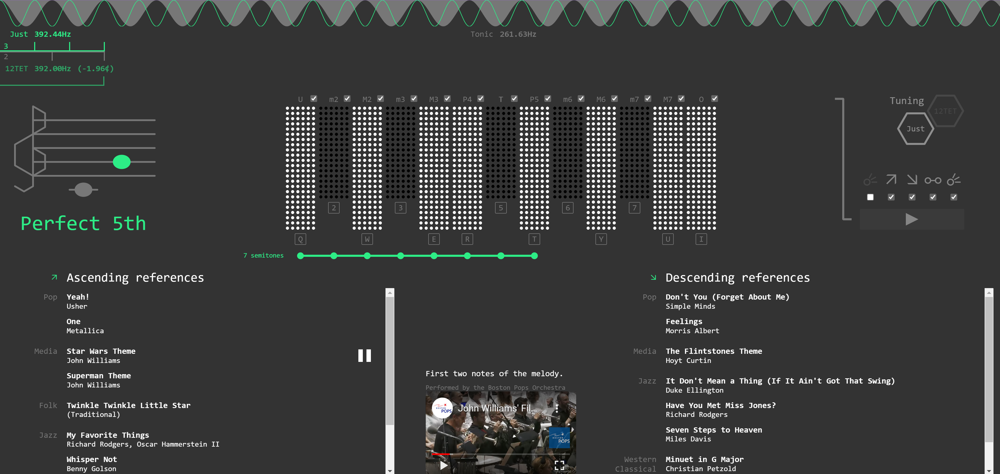

# Interval Clinic

A single-page web app for exploring and training your ear to hear essential musical intervals in the common Western scale of 12-tone equal temperament.

## Scripts

In the project directory, you can run:

### `npm start`

Runs the app in the development mode. 
Open [http://localhost:3000](http://localhost:3000) to view it in the browser.

### `npm test`

Launches the test runner in interactive watch mode. 

### `npm run build`

Builds the app for production to the `build` folder. 
